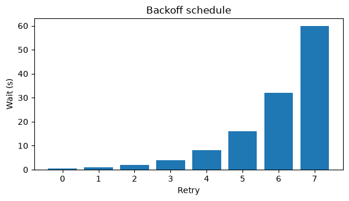

# Examples

Each card is a notebook from the repository's `docs/examples/` directory, rendered with
its saved outputs.

- [{ loading=lazy }](getting_started.md "Getting started")
    **Getting started**

